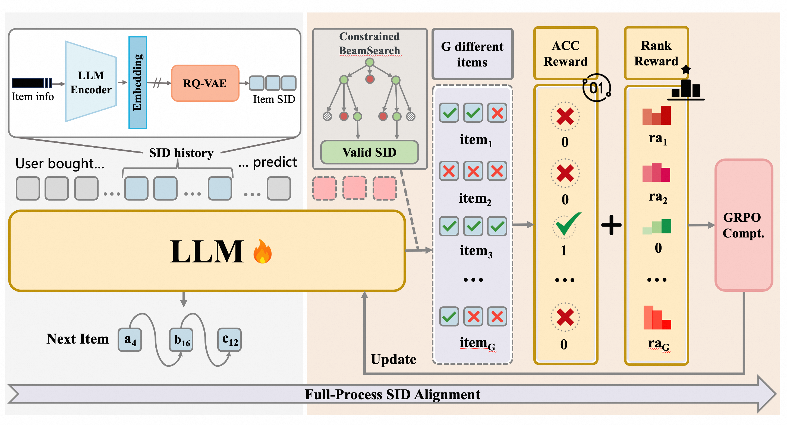
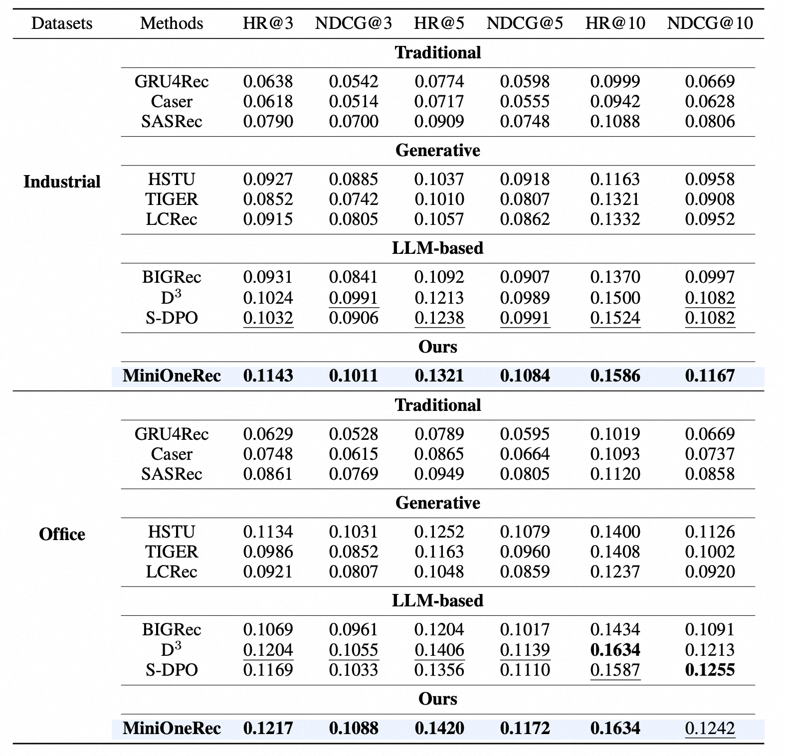

<div align="center">


</img> 

**An Open-Source Framework for
Scaling Generative Recommendation**


<a href="https://arxiv.org/abs/2510.24431"></a>

<a href="https://arxiv.org/abs/2510.24431">📄 Technical Report</a> | <a href="https://huggingface.co/kkknight/MiniOneRec">🤗 Huggingface</a> | <a href="https://modelscope.cn/models/k925238839/MiniOneRec">🤖  Modelscope</a>
</div>

**MiniOneRec** is the first fully open-source **generative recommendation** framework, which provides an end-to-end workflow spanning **SID construction**, **supervised fine-tuning (SFT)**, and recommendation-oriented **reinforcement learning (RL)**. 

---

## 📢 Announcement

- 2025-12-04 — We update new scripts to support processing the Amazon23 dataset.

- 2025-12-01 — We fix a bug in data.py that could cause the SID–item alignment task to see the answers in advance. This was because we had previously attempted to use partial trajectories to guide the full SID–item generation and does not affect the model performance.

- 2025-11-20 — The SID construction method in **RQ-Kmeans+** has been updated (first proposed in **GPR** and this is the first open-source reproduction).

- 2025-11-19 — We implemented a multi-GPU parallel text-to-embedding method based on Accelerate, which is significantly more efficient than the original version: rq/text2emb/amazon_text2emb.py

- 2025-11-19 — The SID construction method in **constrained-RQ-Kmeans** has been updated.

- 2025-11-07 — Thank you for submitting issues! Based on your feedback, we have released a new implementation. If you encounter any problems while running the code, please update to and consult the **latest version** first.
  
- 2025-11-07 — You can now choose to freeze the LLM parameters during the SFT stage and train only the embeddings for the newly added SID vocabulary.

- 2025-10-31 — You can now directly download the implementation **checkpoints** of our MiniOnRec model.

- 2025-10-31 — The SID construction method in **RQ-Kmeans** has been updated.

---

## 🛠️ Key Techniques 
<div align="center">
</img> 
</div>

- **SID Construction: MiniOneRec begins by transforming every product into a compact, semantically meaningful token.** It concatenates an item’s title and description, feeds this sentence through a frozen text encoder, and then quantises the resulting embedding with a three-level RQ-VAE.

- **SFT: With all items rewritten as SIDs, the model is first trained in a supervised fashion.** It views the chronologically ordered user history as a token sequence and learns, via next-token prediction, to generate the SID of the next product the user is likely to consume. Crucially, this stage is co-trained with a set of language-alignment objectives that map back and forth between natural language and SID space, allowing the recommender to inherit the world knowledge embedded in large language models while grounding that knowledge in discrete item codes.

- **Recommendation-Oriented RL: After SFT, MiniOneRec is further polished with a recommendation-oriented RL phase based on GRPO.** Multiple candidate recommendations are generated for each prompt, their rewards are normalised within the group to stabilise gradients, and a KL penalty keeps the updated policy close to its reference. Because the action space is a closed list of item SIDs, the system switches to constrained beam search, which guarantees that every beam is unique and valid, greatly improving sampling efficiency and diversity. The reward signal itself blends a binary correctness term with a rank-aware component that penalises high-probability yet incorrect items more heavily, and can be augmented with collaborative-filtering scores. Together, this pipeline enables MiniOneRec to couple dense linguistic knowledge, achieving a high-performance, lightweight generative recommendation system.

---

## 📊 Evaluation

<div align="center">
</img> 
</div>

---

## 🗂️ Repository Overview

| File / Directory          | Description                                                                                                   |
| ------------------------- | ------------------------------------------------------------------------------------------------------------- |
| `sft.sh`                  | Shell script to start the Supervised Fine-Tuning (SFT) stage                                           |
| `sft.py`                  | Python implementation of the SFT training loop                                                            |
| `sft_gpr.py`              | GPR-inspired SFT with Value-Aware Fine-Tuning (VAFT): implements weighted loss based on simulated item value                            |
| `rl.sh`                   | Shell script to start the Reinforcement Learning (RL) stage                             |
| `rl.py`                   | Python implementation of the RL training loop                                              |
| `rl_gpr.py`               | GPR-inspired RL with Hierarchy Enhanced Policy Optimization (HEPO)                                                 |
| `minionerec_trainer.py`   | MiniOneRec trainer — GRPO-based trainer specialized for generative recommendation                              |
| `configs/`                | YAML configuration files                                            |
| `evaluate.sh`     | One-click offline Top-K evaluation script                                                        |
| `evaluate.py`     | Evaluation utilities for computing HR@K and NDCG@K.                                                           |
| `LogitProcessor.py`                | Logit processor for constrained decoding (Python implementation)                                         |
| `data.py`                | Data pipeline for SFT and RL training                          |
| `convert_dataset.py`                | Converts an RQ-trained dataset to the SFT-then-RL format                                            |
| `convert_dataset_gpr.py`           | GPR-inspired dataset converter: injects simulated heterogeneous tokens (U/E/I/O) to emulate unified input representation                                         |
| `data/amazon18_data_process.sh`                |    Shell script to filter and preprocess Amazon18 data into an RQ-ready format                                      |
| `data/amazon18_data_process.py`                |   Python implementation of the Amazon18 data preprocessing pipeline                                        |
| `data/amazon18_data_process_gpr.py`            |   GPR-inspired Amazon18 preprocessing: extracts heterogeneous features for unified input representation                         |
| `data/amazon23_data_process.sh`                |    Shell script to filter and preprocess Amazon23 data into an RQ-ready format                                      |
| `data/amazon23_data_process.py`                |   Python implementation of the Amazon23 data preprocessing pipeline                                        |
| `rq/text2emb/amazon_text2emb.sh`                |   Shell script to generate item embeddings (title + description) via emb_model for the Amazon dataset                                   |
| `rq/text2emb/amazon_text2emb.py`                |   Python implementation of the above embedding generation                                         |
| `rq/text2emb/amazon_text2emb_gpr.py`           |   GPR-inspired text-to-embedding                                 |
| `rq/generate_indices.py`                |   Generates the SID file after training an RQ-VAE model                                       |
| `rq/rqvae.sh`                |   Shell script to train RQ-VAE on Amazon item embeddings                        |
| `rq/rqvae.py`                |   Python implementation of RQ-VAE training                                            |
| `rq/rqkmeans_faiss.py`                |   Python implementation of RQ-Kmeans training based on faiss                                          |
| `rq/rqkmeans_constrained.py`                |   Python implementation of Constrained RQ-Kmeans                         |
| `rq/rqkmeans_constrained.sh`                |   Shell script to train constrained RQ-Kmeans constrained on Amazon item embeddings                        |
| `rq/rqkmeans_plus.py`                |   Python implementation of RQ-Kmeans+                        |
| `rq/rqkmeans_plus.sh`                |   Shell script to train RQ-Kmeans+ constrained on Amazon item embeddings                        |
| `rq/generate_indices_plus.py`                |   Generates the SID file after training an RQ-Kmeans+ model                                       |
| `rq/generate_indices_plus.sh`                |   Shell script to generate the SID file after training an RQ-Kmeans+ model                                       |
| `requirements.txt`        | List of Python dependencies                                                                                |

---

## 🚀 Quickstart

Use the pre-trained Industrial/Office SIDs we provide for a quick start!
Reproduction can be achieved with just 4–8 A100/H100 GPUs.

### 1. Create an isolated Python environment

```bash
conda create -n MiniOneRec python=3.11 -y
conda activate MiniOneRec
```

### 2. Install required packages

```bash
pip install -r requirements.txt
```

### 3. SFT

```bash
bash sft.sh
```

### 4. Recommendation-Oriented RL

```bash
bash rl.sh
```

### 5. Run the evaluation bash

```bash
bash evaluate.sh
```

---

## 📜 Full Pipeline Walk-through

### 0. Prerequisites
- GPUs: <e.g., 4–8 × A100/H100 80 GB or comparable>
- Python: 3.11

### 1. Environment Setup
- **1.1 Clone the repo**
```
git clone https://github.com/AkaliKong/MiniOneRec.git
cd MiniOneRec
```
- **1.2 Create and activate a conda env**
```
conda create -n MiniOneRec python=3.11 -y
conda activate MiniOneRec
```
- **1.3 Install dependencies**
```
pip install -r requirements.txt
```

### 2. Data Preparation

- **2.1 Download the raw dataset (Optional)**  
  Get it from the official page:
  [Amazon Reviews 2023](https://amazon-reviews-2023.github.io/), 
  [Amazon Reviews 2018](https://cseweb.ucsd.edu/~jmcauley/datasets/amazon_v2/), 
  [Amazon Reviews 2014](https://cseweb.ucsd.edu/~jmcauley/datasets/amazon/links.html).
  Note: The Industrial and Office datasets are included in Amazon 2018; the Amazon 2014 and 2023 versions require slight modifications to our data/amazon18_data_process.py.
- **2.2 Filter and preprocess**
```
bash data/amazon18_data_process.sh \
     --dataset  your_dataset_type \ # e.g. Industrial
     --user_k 5 \
     --item_k 5 \
     --st_year 2017 \
     --st_month 10 \
     --ed_year 2018 \
     --ed_month 11 \
     --output_path ./data/Amazon18
```
- **2.3 Encode item text to embeddings**
```
bash rq/amazon_text2emb.sh \
     --dataset your_dataset_type \ # e.g., Industrial 
     --root your_processed_dataset_path \
     --plm_name qwen \
     --plm_checkpoint your_emb_model_path
```

### 3. SID Construction

Choose either 3.1.1, 3.1.2, 3.1.3 or 3.1.4.

- **3.1.1 Train RQ-VAE on the embeddings**
```
bash rq/rqvae.sh \
      --data_path xxx/data/Industrial_and_Scientific/Industrial_and_Scientific.emb-qwen-td.npy \
      --ckpt_dir ./output/Industrial_and_Scientific \
      --lr 1e-3 \
      --epochs 10000 \
      --batch_size 20480
```

- **3.1.2 Train RQ-Kmeans on the embeddings**

```
conda install faiss-gpu
python rqkmeans_faiss.py --dataset Industrial_and_Scientific # The RQ-Kmeans method based on semantic embeddings has a relatively high collision rate.
```

- **3.1.3 Train constrained RQ-Kmeans on the embeddings**
For conflicting items, we add an extra layer to perform deduplication; meanwhile, we use a balanced constraint to ensure that the SIDs are evenly distributed.
```
pip install k_means_constrained
pip install polars
bash rqkmeans_constrained.sh
```

- **3.1.4 Train RQ-Kmeans+ on the embeddings**
```
pip install k_means_constrained
pip install polars
bash rqkmeans_constrained.sh
bash rqkmeans_plus.sh
```

- **3.2 Generate indices(only RQ-VAE & RQ-Kmeans+ needed)**
```
python rq/generate_indices.py
# or
bash rq/generate_indices_plus.sh
```

- **3.3 Convert dataset format**
```
python convert_dataset.py \
     --dataset_name Industrial_and_Scientific \
     --data_dir /path/to/Industrial_and_Scientific \
     --output_dir /path/to/ourput_dir \

```

### 4. SFT

```
bash sft.sh \
     --base_model your_model_path \
     --output_dir your_ourput_dir \
     --sid_index_path your_.index.json_path \
     --item_meta_path your_.item.json_path
```

### 5. Recommendation-Oriented RL
> (Optional) For production-scale datasets, considering the cost of reinforcement learning and diminishing marginal returns, you can perform the RL stage using only a relatively small subset on the order of tens of thousands of samples.
```
bash rl.sh \
     --model_path your_model_path \
     --output_dir output_dir \
```

### 6. Offline Evaluation

```
bash evaluate.sh \
     --exp_name your_model_path 
```

---

## 📝 Upcoming Features

We are actively extending MiniOneRec’s capabilities. The following enhancements are already on our roadmap:
* ⏱️ **More SID Construction Algorithms**: forthcoming support for R-VQ, RQ-Kmeans, RQ-OPQ, and RQ-VAE-v2 (PLUM).
* ⚙️ **MiniOneRec-Think**: a module that seamlessly integrates dialogue, reasoning, and personalized recommendation, providing an all-in-one solution for complex interactive scenarios.
* 🔍 **Broader Dataset Support**: additional popular public datasets, including Yelp, to further validate the generality of our algorithms.

---

## 🏫 Institutions  <!-- omit in toc -->

This project is developed by the following institutions:

-  [LDS](https://data-science.ustc.edu.cn/_upload/tpl/15/04/5380/template5380/index.html)
-  [AlphaLab](https://alphalab-ustc.github.io/index.html)
-  [NExT](https://www.nextcenter.org/)
 
---

## 🧩 Contributing

We welcome and appreciate all contributions! If you have ideas to improve MiniOneRec, please feel free to submit a pull request (PR).

---
## 🙏 Acknowledgements

This repository reuses or adapts portions of code from the following open-source projects. We gratefully acknowledge their authors and contributors:

- [ReRe](https://github.com/sober-clever/ReRe)
- [LC-Rec](https://github.com/zhengbw0324/LC-Rec)

---

## 🔖 Citation <!-- omit in toc -->

If you find our code/paper/model helpful, please consider citing our papers 📝 and staring us ⭐️！

```bib
@misc{MiniOneRec,
      title={MiniOneRec: An Open-Source Framework for Scaling Generative Recommendation}, 
      author={Xiaoyu Kong and Leheng Sheng and Junfei Tan and Yuxin Chen and Jiancan Wu and An Zhang and Xiang Wang and Xiangnan He},
      year={2025},
      eprint={2510.24431},
      archivePrefix={arXiv},
      primaryClass={cs.IR},
}

@article{ReRe,
      title={Reinforced Preference Optimization for Recommendation}, 
      author={Junfei Tan and Yuxin Chen and An Zhang and Junguang Jiang and Bin Liu and Ziru Xu and Han Zhu and Jian Xu and Bo Zheng and Xiang Wang},
      journal={arXiv preprint arXiv:2510.12211},
      year={2025},
}

@inproceedings{RecZero,
      title={Think before Recommendation: Autonomous Reasoning-enhanced Recommender}, 
      author={Xiaoyu Kong and Junguang Jiang and Bin Liu and Ziru Xu and Han Zhu and Jian Xu and Bo Zheng and Jiancan Wu and Xiang Wang},
      year={2025},
      booktitle={NeurIPS},
}

```

---

<div align="center">
We welcome contributions from the community! 🤝
</div>
